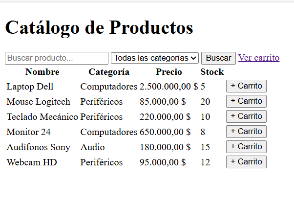
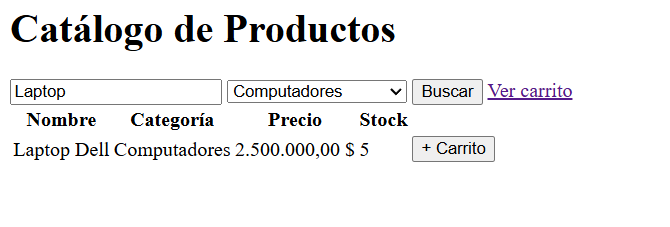
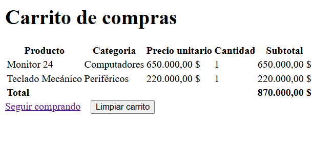

# Catalogo Web - Guia de Ejecucion

Aplicacion web Java (Servlets + JSP + JSTL) empaquetada como WAR y desplegada en Apache Tomcat.

## Requisitos

- Java 17 instalado
- Maven Wrapper incluido en el proyecto
- Apache Tomcat 10+ instalado

## Estructura principal

- Proyecto Maven: [catalogo-web](catalogo-web)
- WAR generado: [catalogo-web/target](catalogo-web/target)
- Capturas: [capturas](capturas)

## Ejecucion en local (Tomcat)

1. Abrir terminal en [catalogo-web](catalogo-web).
2. Compilar y empaquetar:

```powershell
.\mvnw.cmd clean package
```

3. Copiar el WAR generado al directorio webapps de Tomcat (ajustar ruta si tu Tomcat esta en otra ubicacion):

```powershell
Copy-Item -Force ".\target\catalogo-web-1.0-SNAPSHOT.war" "C:\Users\sebas\develop\tomcat\webapps\catalogo-web.war"
```

4. Iniciar Tomcat:

```powershell
& "C:\Users\sebas\develop\tomcat\bin\catalina.bat" run
```

5. Abrir en navegador:

- Catalogo: http://localhost:8080/catalogo-web/catalogo
- Carrito: http://localhost:8080/catalogo-web/carrito

## Funcionalidades verificadas

- Listado inicial de 6 productos en el catalogo.
- Busqueda por texto mediante formulario GET.
- Filtro por categoria mediante selector.
- Agregar al carrito con incremento de cantidad cuando se repite producto.
- Limpieza de carrito con redireccion al catalogo.

## Capturas de pantalla

### Vista principal



Archivo: [capturas/part-principal.png](capturas/part-principal.png)

### Filtro por categoria



Archivo: [capturas/filtro.png](capturas/filtro.png)

### Carrito de compras



Archivo: [capturas/carrito-de-compras.png](capturas/carrito-de-compras.png)

